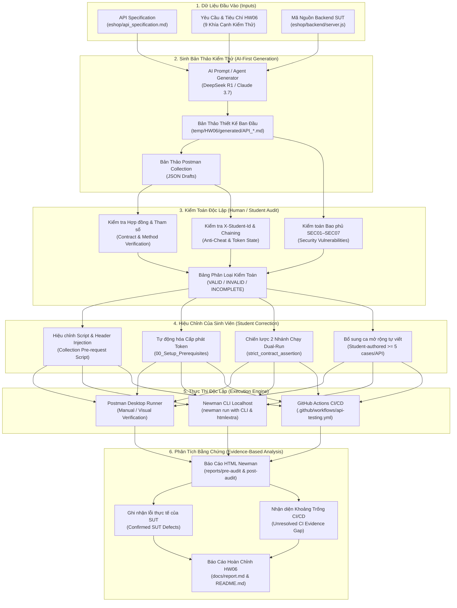

# HW06 - API Test Generator & Audit Workflow)

> Lê Thanh Phong - 23127452

## 1. Sơ Đồ Quy Trình Tự Động Hóa (Generator & Audit Workflow Diagram)

Quy trình phát triển bộ kiểm thử API tuân thủ nghiêm ngặt phương pháp **AI-First Generation $\rightarrow$ Human Audit $\rightarrow$ Student Correction $\rightarrow$ Newman/CI Execution $\rightarrow$ Evidence-Based Analysis**:



---

## 2. Mã Giả Quy Trình Sinh & Kiểm Toán (Pseudocode)

Dưới đây là mã giả thể hiện thuật toán điều phối toàn bộ vòng đời kiểm thử từ sinh mã, kiểm toán, sửa lỗi đến thực thi và phân tích:

```text
ALGORITHM API_Test_Generation_And_Audit_Lifecycle:
    INPUT:
        api_specification: FilePath ("eshop/api_specification.md")
        sut_source_code: FilePath ("eshop/backend/server.js")
        hw06_requirements: CriteriaList [Domain, Boundary, State, Security_SEC01_07, Schema, Chaining, Header, Extensions]
        student_id: String ("23127452")

    OUTPUT:
        final_collections: List of PostmanCollection
        test_reports: List of HTMLReport
        audit_records: AuditLogFile
        confirmed_bugs: BugRegister

    // GIAI ĐOẠN 1: AI-FIRST TEST GENERATION
    FOR EACH api IN [API_A_Products, API_B_Cart, API_C_ImportProducts] DO:
        contract = ExtractContract(api_specification, api)
        code_slice = ExtractBackendImplementation(sut_source_code, api)
    
        // Sinh bản thảo thiết kế kiểm thử bao phủ 9 khía cạnh kỹ thuật
        ai_draft_plan = AI_Generate_Test_Plan(contract, code_slice, hw06_requirements, min_cases=35)
        ai_collection = AI_Generate_Postman_JSON(ai_draft_plan)
    END FOR

    // GIAI ĐOẠN 2: HUMAN AUDIT (KIỂM TOÁN CỦA SINH VIÊN)
    FOR EACH collection IN [ai_collection_A, ai_collection_B, ai_collection_C] DO:
        FOR EACH request IN collection.requests DO:
            // 1. Kiểm toán Header bắt buộc chống gian lận
            IF NOT Has_Collection_Level_Header(collection, "X-Student-Id", student_id) THEN
                RecordAuditFinding(request, "Missing automated X-Student-Id trace", classification=INVALID)
            END IF

            // 2. Kiểm toán quản lý Token và Phụ thuộc Trạng thái
            IF request.requires_auth AND request.uses_hardcoded_token THEN
                RecordAuditFinding(request, "Hardcoded expiring JWT token detected", classification=INVALID)
            END IF

            // 3. Kiểm toán kỳ vọng khi gặp khiếm khuyết SUT (SUT Defects)
            IF request.tests_sut_defect AND request.asserts_actual_200_only THEN
                RecordAuditFinding(request, "Weak assertion hiding SUT defect", classification=INVALID)
            END IF
        END FOR
    END FOR

    // GIAI ĐOẠN 3: STUDENT CORRECTION (HIỆU CHỈNH KỸ THUẬT)
    FOR EACH collection IN [ai_collection_A, ai_collection_B, ai_collection_C] DO:
        // Cài đặt Script tự động gắn Header và log console tại cấp Collection
        collection.pre_request_script = """
            pm.request.headers.upsert({ key: 'X-Student-Id', value: pm.environment.get('studentId') });
            console.log('[X-Student-Id] Attached Header: X-Student-Id: ' + pm.environment.get('studentId'));
        """

        // Cấp phát token động qua Setup requests
        IF collection.has_authenticated_endpoints THEN
            collection.prepend_folder("00_Setup_Prerequisites", [
                RegisterDynamicUser(),
                LoginDynamicUser()
            ])
        END IF

        // Cài đặt chiến lược 2 nhánh chạy (Dual-Run Strategy cho REQ-49)
        FOR EACH test_case IN collection.defect_detection_cases DO:
            test_case.test_script = """
                const strict = pm.environment.get('strict_contract_assertion') === 'true';
                if (strict) {
                    pm.response.to.have.status(expected_contract_status);
                } else {
                    pm.expect([actual_sut_status, expected_contract_status]).to.include(pm.response.code);
                    console.warn('[DEFECT RECORDED] SUT bug captured.');
                }
            """
        END FOR

        // Bổ sung tối thiểu 5 ca kiểm thử mở rộng tự viết (Student-Authored Extensions)
        collection.append_folder("07_Extended_Behaviors", GenerateStudentExtensions(api, min_cases=5))
    END FOR

    // GIAI ĐOẠN 4: EXECUTION (THỰC THI KIỂM THỬ)
    FOR EACH mode IN ["all-pass", "bug-evidence"] DO:
        env = LoadEnvironment(mode)
        FOR EACH collection IN final_collections DO:
            report_name = "newman-" + collection.name + "-" + mode + ".html"
            exit_code = ExecuteNewman(collection, env, reporter="htmlextra", export_path=report_name)
        END FOR
    END FOR

    // GIAI ĐOẠN 5: EVIDENCE ANALYSIS (PHÂN TÍCH BẰNG CHỨNG)
    FOR EACH report IN GeneratedReports DO:
        FOR EACH failure IN report.failed_assertions DO:
            root_cause = InspectTraceAndSourceCode(failure)
            IF root_cause == "SUT_DEFECT" THEN
                confirmed_bugs.append(failure, severity=EvaluateSeverity(failure))
            ELSE IF root_cause == "SYNTAX_ERROR" THEN
                RecordScriptBug(failure)
            ELSE IF root_cause == "CROSS_API_DIRTY_DB" THEN
                RecordEnvironmentIssue(failure)
            END IF
        END FOR
    END FOR

    // GIAI ĐOẠN 6: ĐÁNH GIÁ KHOẢNG TRỐNG CI/CD
    ci_runs = FetchGitHubActionsRuns()
    IF NOT HasRunAllPass(ci_runs) OR NOT HasRunFailure(ci_runs) THEN
        RecordUnresolvedGap("CI/CD Dual-Run Evidence Missing on GitHub Actions")
    END IF

    RETURN final_collections, test_reports, audit_records, confirmed_bugs
END ALGORITHM
```

---

## 3. Đặc Tả Luồng Chuyển Giao Dữ Liệu (Flow Transitions)

1. **Input $\rightarrow$ Generation:**
   - Đầu vào là đặc tả API `api_specification.md`, mã nguồn `server.js` và 9 tiêu chí thiết kế HW06.
   - AI Agent sinh ra bản thảo kịch bản kiểm thử có cấu trúc phân tầng (`01_Domain_Partitioning` đến `07_Extended_Behaviors`).
2. **Generation $\rightarrow$ Audit:**
   - Sinh viên rà soát thủ công 100% các request để phát hiện: token dán cứng, thiếu header bắt buộc, assertion bị làm yếu hoặc sai lệch cú pháp.
3. **Audit $\rightarrow$ Correction:**
   - Sinh viên tiến hành sửa đổi kỹ thuật: thêm script tự động `X-Student-Id`, cài đặt setup token động, triển khai cơ chế dual-run qua cờ `strict_contract_assertion` và bổ sung 5 ca mở rộng chuyên sâu.
4. **Correction $\rightarrow$ Execution:**
   - Bộ kiểm thử hoàn thiện được nạp vào Postman Runner và Newman CLI để chạy thực nghiệm dưới 2 môi trường: `Environment` (chế độ nền all-pass) và `BugEvidence` (chế độ bằng chứng lỗi).
5. **Execution $\rightarrow$ Analysis:**
   - Báo cáo HTML được bóc tách dữ liệu để phân loại chính xác các lỗi SUT thật, lỗi kịch bản và nhận diện khoảng trống thực thi trên GitHub Actions runner.
